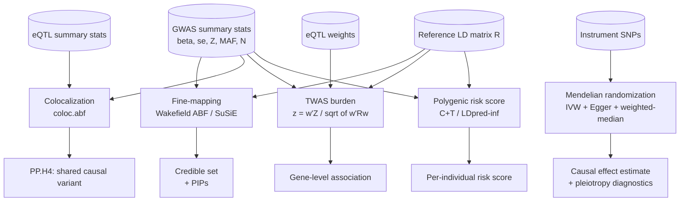

# post-gwas-causal

*Post-GWAS causal-mechanism toolkit — fine-mapping, colocalization, Mendelian randomization, TWAS, and polygenic risk scoring, all from summary statistics.*

[](https://github.com/abayatibrain/post-gwas-causal/actions/workflows/ci.yml)   

## What biological question this answers

A genome-wide association study (GWAS) tells you that a region of the genome is
*statistically associated* with a disease. It almost never tells you **which
variant** is causal, **which gene** that variant acts through, **which
direction** the causal arrow points, or **how much** of an individual's risk
the genetics explains. This toolkit turns an association signal into a
mechanistic, actionable story:

- **Fine-mapping** — of the dozens of correlated SNPs at a hit locus, which
  handful could actually be the causal one? (95% credible sets.)
- **Colocalization** — does the disease signal and the signal controlling a
  nearby gene's expression share the *same* causal variant — i.e. does the
  disease act *through that gene*?
- **Mendelian randomization** — using genetic variants as natural experiments,
  does an exposure (a biomarker, a drug-target's activity) **causally** affect
  the disease, and in which direction?
- **TWAS** — is *genetically predicted expression* of a specific gene
  associated with the trait, prioritising a gene out of the locus?
- **Polygenic risk scoring** — collapsing thousands of small effects into a
  single per-person risk score that can stratify a population.

Together these are the standard post-GWAS analyses a statistical-genetics
scientist runs to go from "this locus is associated" to "this gene, this
variant, this direction of effect, this much risk."

## The five methods



## Quickstart

```bash
git clone https://github.com/abayatibrain/post-gwas-causal
cd post-gwas-causal
uv sync --all-extras --dev

# Simulate a locus and run each method on it.
uv run post-gwas-causal simulate --out results/locus.json --n-snps 50
uv run post-gwas-causal finemap --method abf
uv run post-gwas-causal coloc --shared
uv run post-gwas-causal mr --pleiotropy 0.0
uv run post-gwas-causal twas
uv run post-gwas-causal prs
```

## Methods at a glance

| Module | Method | Key reference |
| --- | --- | --- |
| `finemap.abf` | Wakefield approximate Bayes factors, PIPs, credible sets | Wakefield 2009 |
| `finemap.susie` | SuSiE-RSS (sum of single effects, IBSS) | Wang 2020; Zou 2022 |
| `coloc.abf` | Bayesian colocalization (PP.H0–H4) | Giambartolomei 2014 |
| `coloc.susie` | SuSiE-based colocalization (multiple causal variants, per-credible-set PP.H4) | Wallace 2021 |
| `mr.ivw` | Inverse-variance-weighted MR (fixed + random) | Burgess 2013 |
| `mr.egger` | MR-Egger slope + pleiotropy intercept | Bowden 2015 |
| `mr.weighted_median` | Weighted-median MR (robust) | Bowden 2016 |
| `mr.heterogeneity` | Cochran's Q | Bowden 2017 |
| `twas.burden` | FUSION-style TWAS Z-statistic | Gusev 2016 |
| `prs.clump_threshold` | Clumping + p-value thresholding (C+T) | Choi 2020 |
| `prs.shrinkage` | LDpred-inf infinitesimal shrinkage | Vilhjálmsson 2015 |

## R cross-checks

The Python implementations are validated against the field-standard R packages
(`susieR`, `coloc`, `TwoSampleMR`) through thin wrappers in `scripts/R/`. R is
optional — see [`scripts/R/README.md`](scripts/R/README.md). Tests that shell
out to `Rscript` are marked `requires_r` and skip cleanly when R is absent.

## Documentation

- [Biology primer](docs/biology.md) — the plain-language story.
- [Methods](docs/methods.md) — the statistics, with citations.
- [Architecture](docs/architecture.md) — how the package is laid out.
- [Decision log](docs/adrs/) — the three architecture decision records.

## License

MIT © 2026 Armin Bayati
