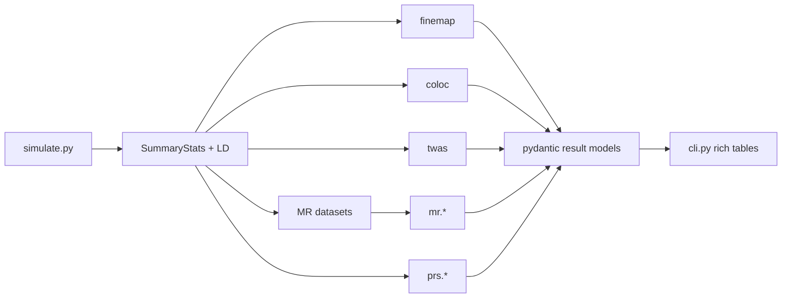

# Architecture

## Layout

```
src/post_gwas_causal/
├── __init__.py
├── simulate.py          # LD-aware GWAS summary-stat generators (pydantic configs)
├── finemap/
│   ├── abf.py           # Wakefield ABF, PIPs, credible sets
│   └── susie.py         # SuSiE-RSS (IBSS) multi-effect finemapper
├── coloc/
│   └── abf.py           # Giambartolomei coloc.abf (PP.H0–H4)
├── mr/
│   ├── ivw.py           # inverse-variance-weighted
│   ├── egger.py         # MR-Egger slope + pleiotropy intercept
│   ├── weighted_median.py
│   ├── heterogeneity.py # Cochran's Q
│   └── harmonize.py     # effect-allele alignment
├── twas/
│   └── burden.py        # FUSION burden Z
├── prs/
│   ├── clump_threshold.py
│   ├── shrinkage.py     # LDpred-inf
│   └── evaluate.py      # R², AUC
├── rbridge.py           # optional Rscript shell-out (skip-able)
└── cli.py               # typer entry point
```

## Design principles

- **Summary-statistics first.** Every method consumes per-SNP `(beta, se, Z)`
  and, where needed, an LD matrix `R`. No individual-level genotypes are
  required (the PRS scorers accept a target dosage matrix, since scoring is
  inherently per-individual).
- **Pydantic everywhere.** Configs (`LocusConfig`, `ColocConfig`, `MRConfig`)
  and results (`AbfResult`, `ColocResult`, `IVWResult`, …) are pydantic models:
  validated, serializable, and self-documenting. Array fields are stored as
  lists with `*_arr` NumPy convenience properties.
- **Numerically careful.** Bayes factors and posteriors are computed in log
  space (`logsumexp`, stable softmax) so large Z-scores do not overflow.
- **Known-answer testing.** The `simulate` module generates data under known
  ground truth, so every method is validated against an answer we already know
  (credible set contains the true SNP; PP.H4 high under a shared causal; IVW
  recovers the true effect; etc.).
- **R as the reference, Python as the implementation.** The `scripts/R/`
  mirrors run `susieR` / `coloc` / `TwoSampleMR`; `rbridge.py` shells out to
  them and raises a clean, skip-able error when `Rscript` is absent. R is never
  required to use the package or run CI.

## Data flow


